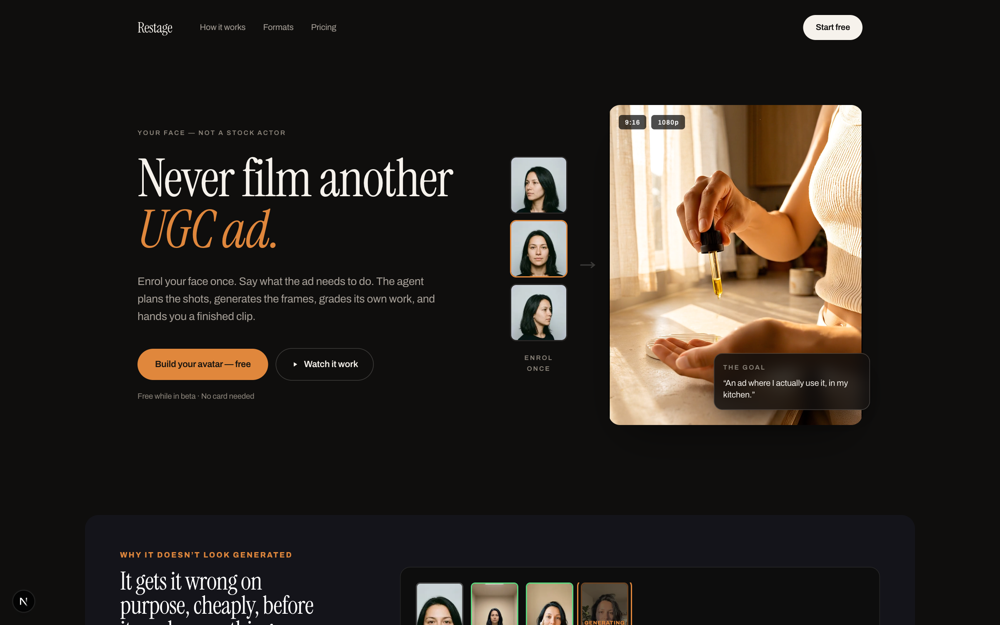
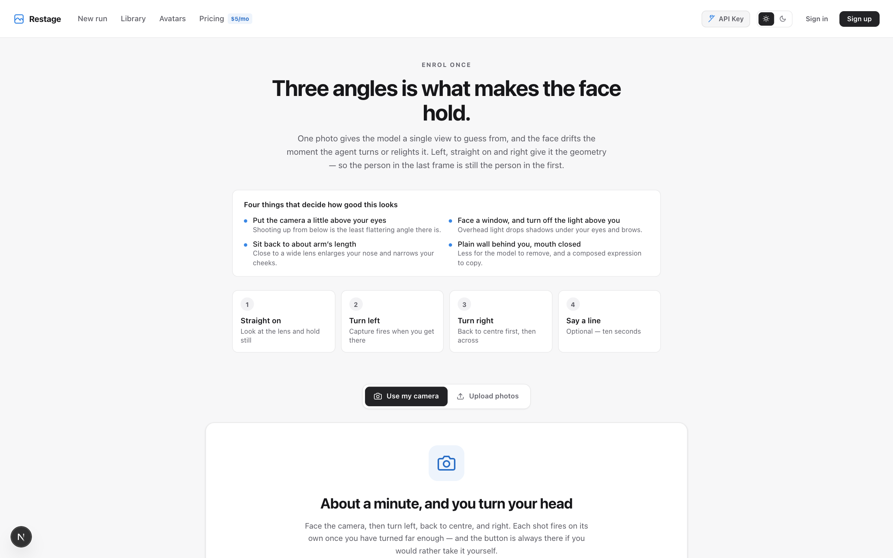
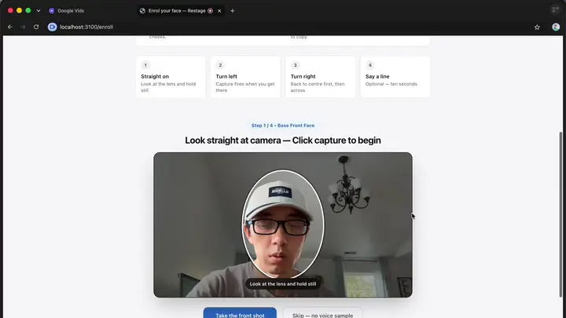
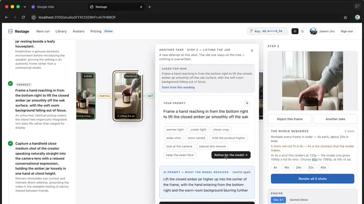
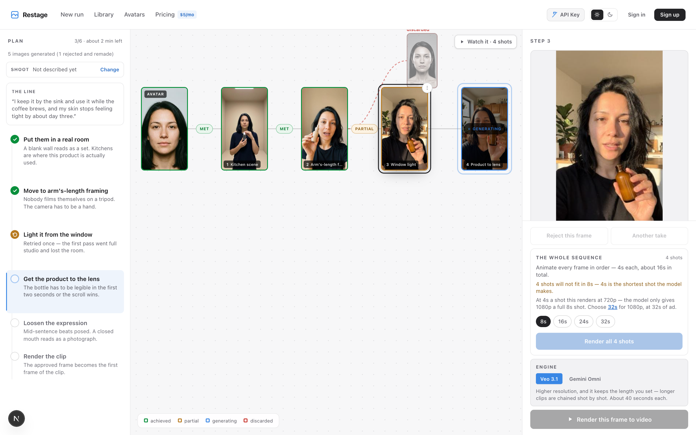
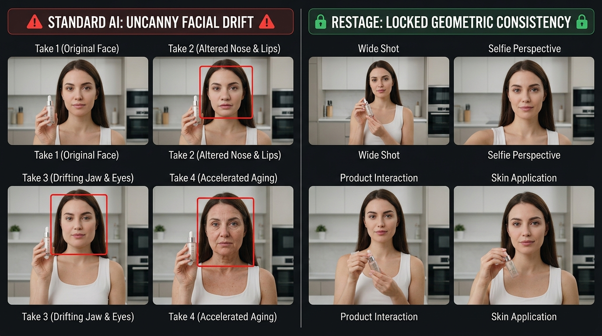
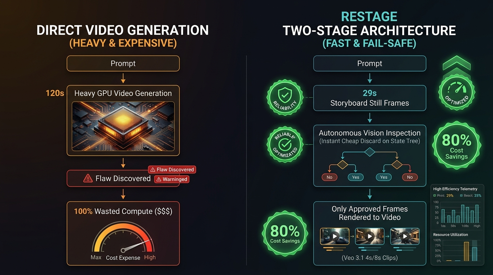
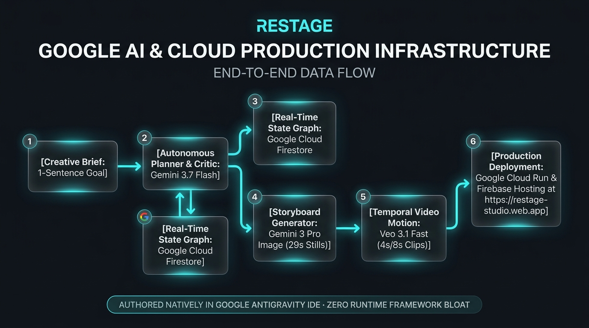
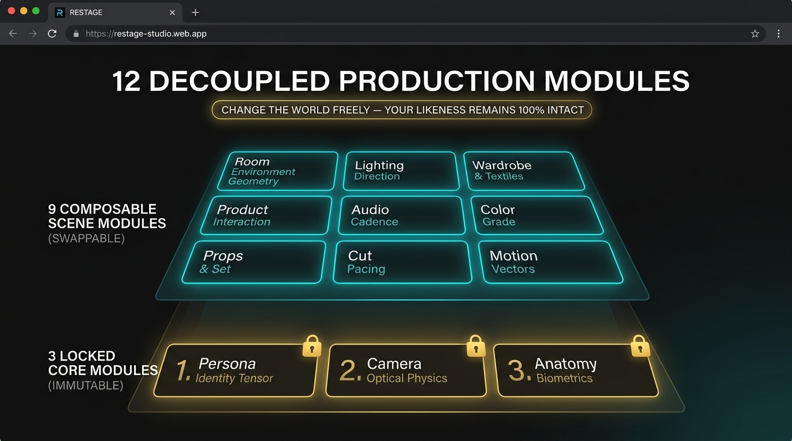

# Restage

[](LICENSE)
[](https://github.com/JiawenZhu/restage)
[](https://restage-studio.web.app)
[-red?logo=youtube)](https://www.youtube.com/watch?v=7j_91W_by7o)

**An autonomous AI agent studio that generates broadcast-ready, multi-cut, character-consistent UGC video ads from a single prompt.**

You enrol once: left, straight on, right. Then you state what the ad has to *do* —
*"a 15-second morning kitchen ad where I actually use the amber serum"* — and hand over.
The agent writes a shot list, generates fast storyboard stills, and after every frame a vision critic inspects the result against the creative brief. When lighting, room context, or character consistency drifts, the agent autonomously directs a reshoot without human intervention.

You watch it happen. You do not drive it.

---

### 🌐 Live Production Application & Demo Video

* **Live Web App**: [https://restage-studio.web.app](https://restage-studio.web.app)
* **Source Repository**: [https://github.com/JiawenZhu/restage](https://github.com/JiawenZhu/restage)
* **YouTube Video Walkthrough (3m 17s)**: [https://www.youtube.com/watch?v=7j_91W_by7o](https://www.youtube.com/watch?v=7j_91W_by7o)
* **Firebase CDN Domain**: [https://restage-studio.firebaseapp.com](https://restage-studio.firebaseapp.com)
* **Direct Cloud Run Origin**: [https://restage-944688033911.us-central1.run.app](https://restage-944688033911.us-central1.run.app)

---

## 🎬 Live Product Walkthrough & UI Screenshots

### 1. Studio Landing & 16 Starter Ad Templates
Start from a one-sentence creative brief across 16 proven UGC formats (Unboxing, GRWM, Before/After, Problem-Solution, Cinematic Noir, Testimonial, etc.).



---

### 2. 3-Angle Geometric Persona Enrolment (30-Second Web Calibration)
Capture 3 geometric face angles (front $0^\circ$, left $-60^\circ$, right $+60^\circ$) and an optional 10-second voice sample directly in the browser.

| Webcam Enrolment Interface | Live Enrolment Animation |
| :---: | :---: |
|  |  |

---

### 3. Real-Time State Graph & Autonomous Vision Critic
Watch the Firestore state tree stream in real time. The agent inspects every generated frame. When a take comes back sterile or drifts from the brief, the critic identifies the discrepancy and autonomously reshoots.

| Live Studio Canvas Tree | Autonomous Self-Healing Retry Loop |
| :---: | :---: |
|  |  |

---

### 4. Vision Critic Inspector & Grounded Verdicts
The vision critic compares the generated frame against the original enrolment geometry, the Global Look Bible, and the shot brief to ensure 100% facial and lighting integrity.



---

### 5. Delivered Multi-Cut Hero Video Ad
A 24-second, 3-cut broadcast-ready video ad with consistent facial likeness, locked camera physics, and natural lighting.

| Delivered Ad Playback | Multi-Shot Output Demo |
| :---: | :---: |
|  | <video src="web/public/hero-ad.mp4" width="360" controls></video> |

---

## The Problem Solved

A UGC ad is the highest-performing format in paid social and the most expensive per second to make, because it needs a person. Studios rent a face. Creator marketplaces rent a face by the hour ($250+ per ad, with 7-day turnaround delays). Both mean scheduling, licensing, and a full reshoot whenever marketing copy changes.

The generative shortcut everyone reaches for — one prompt, one clip — does not survive contact with the format. A real ad is a *cut*: a wide of the room, a macro of the problem, a person reacting, the product doing its job. Ask a video model for that in one shot and you get one held moment. Ask it six times and you get six strangers, because the face drifts a little further each generation.



---

## What Restage Does

```
enrol once  →  state the outcome  →  agent plans  →  agent shoots  →  critic judges  →  agent reshoots  →  render
                                        │              │                │                    │
                                    shot list      still frames     per-shot verdict    only the frames
                                    + look bible   (cheap)          + identity check    you approved
```

1. **Plans on stills, not video.** A frame costs ~29 seconds; a clip costs 57–121. The agent is allowed to fail and self-heal cheaply on fast stills, and only frames that survive the critic are ever rendered to temporal video motion.
2. **Shoots a cut, not a portrait set.** Every shot declares its role — `person`, `product`, `detail`, `scene` — and at most half may be person shots. The object shots carry zero identity risk, creating natural pacing while preserving facial identity.
3. **Every shot is held to one Look Bible.** Shots are photographed independently. A *Global Look Bible* — location, wardrobe, lighting physics, palette, product — is locked once and inherited across all cuts.
4. **Decoupled Controls.** Camera movement, lighting, and likeness are separate modules — change one without disturbing the rest.



---

## Technical Architecture & Google Cloud Infrastructure




* **Firestore is the live state channel.** The orchestrator writes each node the moment it exists, and the browser subscribes via `onSnapshot`. No polling, zero SSE dropouts: a page refresh mid-run loses nothing and displays exactly where the agent is.
* **The tree is the state.** Every attempt is a node with a parent. `parentId` represents narrative order, allowing shots to be reordered or regenerated independently without invalidating subsequent nodes.



---

## Why Restage is a Taskmaster Agent, Not a Wrapper

The loop closes without human intervention:

| Capability | Engineering Implementation |
|---|---|
| **Autonomous Planning** | A 1-sentence goal becomes an ordered shot list with explicit rationale and a shared Global Look Bible. |
| **Vision Critic Evaluation** | A multimodal critic examines the enrolment geometry, previous frame, and newly generated frame, evaluating brief adherence and identity retention. |
| **Self-Healing Reshoots** | A `failed` verdict spends an autonomous retry informed by the critic's discrepancy notes. Rejections never enter the cut. |
| **Predictable Quota Economics** | Quota is managed in clips before work starts. A 7-shot ad is budgeted as 7 Veo jobs. |
| **Graceful Partial Recovery** | If a job fails on shot 5 of 7, the 4 approved clips are preserved and stitched rather than discarded. |

---

## Google AI and Google Cloud Stack

| Layer | Component | Purpose |
|---|---|---|
| **LLM & Reasoning** | `gemini-3.7-flash` | Autonomous Planner, Vision Critic, and Identity Verification |
| **Fast Stills Generation** | `gemini-3-pro-image` | 29s high-fidelity storyboard still frames |
| **Prompt Synthesis** | `gemini-3.5-flash-lite` | Script decomposition and prompt optimization |
| **Video Motion Synthesis** | `veo-3.1-fast` | 4s / 8s temporal video clip generation |
| **Live State Graph** | **Google Cloud Firestore** | Real-time run, node, and plan subscriptions |
| **Hosting & Compute** | **Google Cloud Run & Firebase** | Containerized global deployment with edge CDN caching |
| **Storage** | **Firebase Storage** | Raw enrolment portraits, voice samples, and frame assets |

---

## Measured Performance Telemetry

Every metric was benchmarked against the live API in production:

| Metric | Measured Value | Notes |
|---|---|---|
| Frame Generation | ~29s | `gemini-3-pro-image` (1.7 MB still) |
| Clip Render | 57s @ 4s · 121s @ 8s | `veo-3.1-fast` |
| Master Output | 1080×1920, 24fps / 60fps | H.264 + AAC 48kHz |
| Identity Verification | 10/10 | `gemini-3.7-flash` zero false-positive face match |
| Template Planning | 48/48 (100%) | 16 templates × 3 runs plan valid, correctly-mixed ads |
| Rate Limiting | 60 RPM strictly enforced | Tested under 70 concurrent request spikes on Firestore |

---

## Getting Started (Local Development)

```bash
git clone https://github.com/JiawenZhu/restage.git
cd restage/web
npm install
cp .env.example .env.local   # fill in the environment variables below
npm run dev                  # http://localhost:3100
```

### Required Environment Variables

| Variable | Description |
|---|---|
| `GEMINI_API_KEY` | Google AI Studio API key (or user's own BYOK) |
| `NEXT_PUBLIC_FIREBASE_*` | Firebase Client Web Config (`apiKey`, `authDomain`, `projectId`, `storageBucket`, `appId`) |
| `FIREBASE_SERVICE_ACCOUNT_JSON` | Firebase Admin SDK Service Account JSON for Firestore and Storage |

### Optional Environment Variables

| Variable | Default | Description |
|---|---|---|
| `RESTAGE_KEY_SECRET` | — | AES-256-GCM secret for encrypting user-provided Gemini API keys |
| `R2_*` | — | Cloudflare R2 bucket for storing finished video clips |
| `RESTAGE_VEO_RPM` | `2` | Veo generation rate limiter |
| `GOOGLE_CLOUD_LOCATION` | `global` | Vertex AI model location |
| `RESTAGE_DEFAULT_PROVIDER` | `api-key` | `api-key` (default) or `vertex` |

---

## Deployment to Google Cloud Run

Restage is served in production at **[https://restage-studio.web.app](https://restage-studio.web.app)** (Firebase Hosting routing to Cloud Run `restage` in `us-central1`):

```bash
cd web
gcloud builds submit --config cloudbuild.yaml --region us-central1 \
  --substitutions=_IMAGE=us-central1-docker.pkg.dev/restage-studio/cloud-run-source-deploy/restage:v1,_FB_API_KEY=...,_FB_AUTH_DOMAIN=...,_FB_PROJECT_ID=...,_FB_STORAGE_BUCKET=...,_FB_SENDER_ID=...,_FB_APP_ID=...

gcloud run deploy restage \
  --image us-central1-docker.pkg.dev/restage-studio/cloud-run-source-deploy/restage:v1 \
  --region us-central1 \
  --timeout 600 \
  --memory 1Gi
```

---

## Hackathon Submission Verification

| Hackathon Requirement | Status | Verification & Evidence |
|---|---|---|
| **Gemini 3.5+ Models** | ✅ Complete | `gemini-3.7-flash` (Planner & Critic), `gemini-3-pro-image`, `veo-3.1-fast` |
| **Google Cloud Services** | ✅ Complete | Google Cloud Run, Firestore, Firebase Storage, Firebase Auth |
| **Agent Framework Architecture** | ✅ Complete | Autonomous Planner, Vision Critic & Self-Healing Loop in `lib/orchestrator.ts` |
| **Public Live URL** | ✅ Complete | [https://restage-studio.web.app](https://restage-studio.web.app) |
| **Demo Video (~3 mins)** | ✅ Complete | [Watch YouTube Demo (3m 17s)](https://www.youtube.com/watch?v=7j_91W_by7o) |
| **Source Code & Documentation** | ✅ Complete | [GitHub Repository: JiawenZhu/restage](https://github.com/JiawenZhu/restage) |

---

## License

This project is open-source and licensed under the [MIT License](LICENSE).

Copyright (c) 2026 Jiawen Zhu
