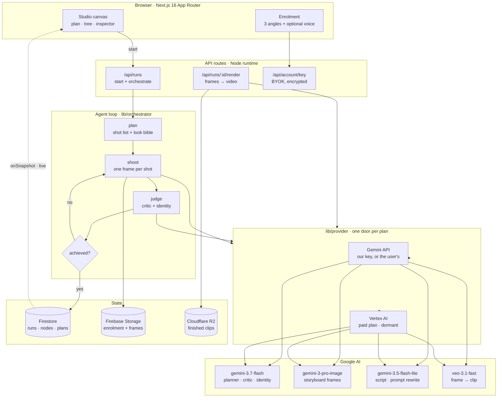

# Restage

**An agent that shoots a UGC video ad with your own face — plans it, shoots it, judges its own work, and reshoots what it got wrong.**

You enrol once: left, straight on, right. Then you say what the ad has to *do* —
*"a 15-second ad where I actually use the serum, in my kitchen"* — and hand over.
The agent writes a shot list, generates each shot, and after every one a vision
critic looks at the result and decides whether it achieved the thing it was asked
for. When it did not, the agent tries again on its own.

You watch it happen. You do not drive it.

> **`Restage` is a placeholder name.** It appears throughout the repo and this
> README; renaming is a find-and-replace when the real name is settled.

---

## The problem

A UGC ad is the highest-performing format in paid social and the most expensive
per second to make, because it needs a person. Studios rent a face. Creator
marketplaces rent a face by the hour. Both mean scheduling, licensing, and a
reshoot whenever the copy changes.

The generative shortcut everyone reaches for — one prompt, one clip — does not
survive contact with the format. A real ad is a *cut*: a wide of the room, a macro
of the problem, a person reacting, the product doing its job. Ask a video model
for that in one shot and you get one held moment. Ask it six times and you get six
strangers, because the face drifts a little further each generation.

## What it does

```
enrol once  →  state the outcome  →  agent plans  →  agent shoots  →  critic judges  →  agent reshoots  →  render
                                        │              │                │                    │
                                    shot list      still frames     per-shot verdict    only the frames
                                    + look bible   (cheap)          + identity check    you approved
```

**It plans on stills, not video.** A frame costs ~29 seconds; a clip costs 57–121.
So the agent is allowed to be wrong cheaply, and only frames that survive the
critic are ever paid to become video.

**It shoots a cut, not a portrait set.** Every shot declares what it is *of* —
`person`, `product`, `detail`, `scene` — and at most half may be person shots. The
object shots carry no identity risk at all, which is both why the ad looks like an
ad and why the face survives to the end.

**Every shot is held to one look.** Because shots are photographed independently,
nothing is inherited between them. A *look bible* — location, wardrobe, light,
palette, product — is written once and every shot is generated against it, which
is what makes six separate photographs read as one afternoon.

**Its failures stay on the canvas.** A rejected attempt is not hidden. It is the
evidence that something judged the work, and hiding it removes the proof.

## Why this is an agent and not a chat wrapper

The loop closes without a human in it:

| | |
|---|---|
| **It decides the work** | A goal becomes an ordered shot list with a stated reason per shot, and a shared look every shot is bound to. Nobody writes the prompts. |
| **It grades its own output** | A vision critic sees the enrolment photo, the previous frame and the new one, and returns a verdict, whether the face still matches, and what specifically to change. |
| **It acts on the verdict** | A `failed` verdict spends a retry, informed by the critic's note. A frame the critic rejects never enters the final cut. |
| **It knows what its choices cost** | Quota is charged in *clips*, not requests, before the work starts — a seven-shot render is seven Veo jobs and is refused as seven. |
| **It survives its own failures** | A render that dies at shot 5 of 7 keeps the four clips already paid for and stitches them, rather than discarding billed work. |

The interface exists to make that visible: the plan appears before any work
starts, the tree fills in as the agent moves through it, and every verdict is
readable on the node it belongs to.

## Architecture



**Firestore is the live channel.** The orchestrator writes each node the moment it
exists, and the browser subscribes. There is no SSE endpoint and no polling: the
write *is* the update, which also means a refresh mid-run loses nothing and a run
that dies leaves a readable record of how far it got.

**The tree is the state.** Every attempt is a node with a parent. `parentId` is
narrative order, not generation source — which is what lets a shot be reordered,
disconnected or replaced without invalidating the ones after it.

## Architectural discipline

A few decisions that were load-bearing, each with the reason it exists:

- **Provider is pinned per run, never per call.** A plan change mid-run would
  otherwise render the first three shots on one model and the last four on
  another, in an ad whose entire promise is that the frames look like one shoot.
- **Credentials never leave `lib/provider`.** Callers pass a `uid` and get back a
  finished header. A user's own API key is AES-256-GCM encrypted at rest and is
  never returned to a client, never written to a run, never logged.
- **Billing state is not client-writable.** `plan` and credentials live in
  `users/{uid}/private/account`, denied to clients outright in `firestore.rules`.
  On the user document — which is owner-writable — upgrading yourself would have
  been one `setDoc` from the browser console.
- **No cross-provider fallback.** A paid run that quietly finished on somebody's
  personal key would spend the wrong quota and hide an outage behind a success.
- **The rate limiter holds under load.** It failed open on Firestore contention,
  which is proportional to load — so the ceiling lifted at exactly the moment it
  existed for. Measured: 70 concurrent requests against a limit of 60 now admit 60.

## Two ways to run it

| | **Your own API key** | **Paid** |
|---|---|---|
| Who pays Google | You | Restage |
| Quota | Yours | Ours |
| Models | Identical | Identical |

Restage supplies a Gemini key by default. Saving your own overrides it. The paid
plan ships in this repository but is **dormant** — every account defaults to the
key path, and no route can set `plan`, so it only moves server-side. Four
independent conditions are asserted in `scripts/check-providers.mts`.

## Google AI and Google Cloud

| Layer | Used |
|---|---|
| Models | `gemini-3.7-flash` · `gemini-3-pro-image` · `gemini-3.5-flash-lite` · `veo-3.1-fast` |
| Access | Gemini API **and** Vertex AI, behind one `lib/provider` seam |
| Cloud | **Firestore** (run + node state, live subscriptions) · Firebase Auth · Firebase Storage |
| Built in | **Antigravity**, Google's agentic development environment |

Worth being precise about the last row, because it is a claim about how this was
built rather than about what it imports: the agent loop in `lib/orchestrator` is
written directly against the REST API, and the model calls all pass through three
functions in `lib/provider`. There is no agent library in the dependency tree —
`@google/genai` is declared and currently imported by nothing.

## Measured, not estimated

Every number here came from the live API, not a datasheet:

| | |
|---|---|
| Frame generation | ~29s (`gemini-3-pro-image`, 1.7 MB) |
| Clip render | 57s at 4s · 121s at 8s |
| Output | 1080×1920, 24fps, h264 + AAC |
| Identity check | `gemini-3.7-flash` 10/10 on faceMatches; `gemini-3.5-flash-lite` 6/10 — near chance, wrong in both directions |
| Templates | 48/48 (16 templates × 3 runs) plan a valid, correctly-mixed ad |
| Veo free tier | 2 requests/min, 10/day — which is why the paid path exists |

Two that cost real debugging: **1080p is refused below an 8-second shot**, so a
7-shot ad has to be 56s to get it; and the **`global` Vertex endpoint serves the
3.x models while every region tested serves only 2.5** — the paid path looked
worse than the key path for a while, and the cause was a region, not a model.

## Run locally

```bash
git clone https://github.com/JiawenZhu/restage.git
cd restage/web
npm install
cp .env.example .env.local   # then fill in the values below
npm run dev                  # http://localhost:3100
```

**Required**

| Variable | What it is |
|---|---|
| `GEMINI_API_KEY` | Google AI Studio key. Without it every run fails with a clear message. |
| `NEXT_PUBLIC_FIREBASE_*` | Firebase web config (apiKey, authDomain, projectId, storageBucket, messagingSenderId, appId) |
| `FIREBASE_SERVICE_ACCOUNT_JSON` | Service-account JSON, single line. Admin SDK — Firestore and Storage. |

**Optional**

| Variable | Default | What it changes |
|---|---|---|
| `RESTAGE_KEY_SECRET` | — | Required only to let users save their own API key |
| `R2_*` | — | Cloudflare R2 for finished clips (account, bucket, access key, secret) |
| `RESTAGE_VEO_RPM` | `2` | Submission pacing. Raise it on a paid tier. |
| `GOOGLE_CLOUD_LOCATION` | `global` | Pinning a region drops to the 2.5 models |
| `RESTAGE_DEFAULT_PROVIDER` | `api-key` | Set to `vertex` to enable the paid path |

Firestore rules and indexes are in `firestore.rules` and `firestore.indexes.json`.

## Repository guide

```
web/
  app/api/          15 routes — runs, render, avatars, account, tts
  lib/
    orchestrator.ts the agent loop: plan → shoot → judge → retry
    provider.ts     one door per plan; credentials never leave this file
    gemini.ts       prompts and model calls
    sequence.ts     the lineage walk — which frames are in the cut
    look.ts         the look bible, and photographic direction per shot kind
    rateLimit.ts    per-account spend ceiling, counted in clips
    templates.ts    16 authored ad formats
  components/       studio canvas, version tree, enrolment
  scripts/          20 check-*.mts suites, runnable against the live stack
design/             artboards and the published canvas
tools/              standalone generation scripts
```

## Tests

```bash
cd web
npx tsc --noEmit
npx tsx scripts/check-providers.mts    # routing, key encryption, no crossing over
npx tsx scripts/check-sequence.mts     # which frames reach the final cut
npx tsx scripts/check-health.mts       # Firestore, storage, quota under contention
npx tsx scripts/check-templates.mts    # all 16 templates plan a valid ad
```

Most run offline. `check-templates` and `check-providers --live` call the API.

## Submission status

Against the [All Things Agentic](https://allthingsagentichackathon.devpost.com/)
requirements, stated plainly rather than optimistically:

| Requirement | Status |
|---|---|
| Gemini 3.5+ via Gemini API or Vertex AI | ✅ both |
| A Google Cloud service | ✅ Firestore, Auth, Storage |
| A Google Agent Framework | ✅ **Antigravity** — as the environment this was built in, not as a runtime dependency |
| Spin-up instructions | ✅ above |
| Architecture diagram | ✅ above |
| Hosted URL | ⬜ `[DEPLOYMENT URL]` |
| ~4-min demo video | ⬜ needs proof of Google Cloud deployment |

## What's next

- Move the model calls onto `@google/genai`, which is already a dependency. The
  three functions in `lib/provider` are the only places that would change, and it
  would make the framework claim provable from the imports rather than from the
  environment it was written in.
- Stripe behind the `plan` field; the provider split already waits for it
- A settings screen for BYOK — the API exists, nothing calls it
- ArcFace-class face embeddings. Both models pass a within-demographic swap 0/5;
  the critic catches it, the dedicated verifier does not.

## License

Not yet licensed. The person in the design files is generated, not a real
customer — replace before anything ships publicly.
